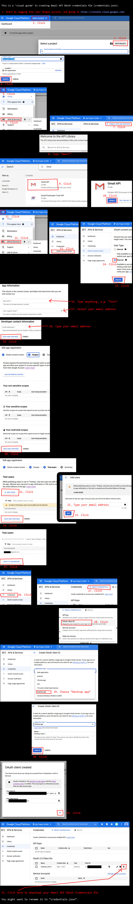

# Gmail-Attachment-Extractor

## Table of Contents
- [Project Overview](#project-overview)
- [Features](#features)
- [Requirements](#requirements)
- [Installation Guide](#installation-guide)
- [Setting Up Gmail API Access](#setting-up-gmail-api-access)
- [Usage](#usage)
- [Contributing](#contributing)
- [License](#license)

## Project Overview

The Gmail Attachment Downloader is a Python-based tool that allows users to efficiently search and download attachments from their Gmail account based on specific criteria. This tool is particularly useful for individuals and organizations that need to manage and archive email attachments in bulk.

### Use Cases

- Archiving important documents sent as email attachments
- Collecting receipts or invoices for expense reports
- Gathering all attachments related to a specific project
- Backing up important files sent via email

## Features

- **Advanced Search**: Filter emails based on various criteria:
  - Date range
  - Attachment file name
  - Attachment size
- **Bulk Download**: Download multiple attachments matching your search criteria in one go
- **Organized Storage**: Automatically create folders for each search query to keep downloads organized
- **Duplicate Handling**: Prevent overwriting by adding unique identifiers to files with the same name
- **User-Friendly Interface**: Easy-to-use Gradio-based web interface

## Requirements

The following Python packages are required to run the Gmail Attachment Downloader:

```
google-auth-oauthlib==0.4.6
google-auth-httplib2==0.1.0
google-api-python-client==2.47.0
gradio==3.23.0
```

These requirements are specified in the `requirements.txt` file, which is included in the project repository.

## Installation Guide

### Prerequisites

- Python 3.7 or higher
- pip (Python package installer)

### Steps

1. Clone the repository:
   ```bash
   git clone https://github.com/your-username/gmail-attachment-downloader.git
   cd gmail-attachment-downloader
   ```

2. Create a virtual environment (optional but recommended):
   ```bash
   python -m venv venv
   source venv/bin/activate  # On Windows, use `venv\Scripts\activate`
   ```

3. Install the required packages:
   ```bash
   pip install -r requirements.txt
   ```

## Setting Up Gmail API Access

To use this tool, you need to set up Gmail API access and obtain a `credentials.json` file. Follow these steps:

1. Go to the [Google Cloud Console](https://console.cloud.google.com/).
2. Create a new project or select an existing one.
3. Enable the Gmail API for your project:
   - In the sidebar, click on "APIs & Services" > "Library"
   - Search for "Gmail API" and click on it
   - Click "Enable"
4. Set up credentials:
   - In the sidebar, click on "APIs & Services" > "Credentials"
   - Click "Create Credentials" and select "OAuth client ID"
   - Choose "Desktop app" as the application type
   - Download the client configuration file and rename it to `credentials.json`
5. Place the `credentials.json` file in the root directory of the project.


## Usage

1. Ensure you have completed the installation steps and have your `credentials.json` file in place.

2. Run the script:
   ```bash
   python main.py
   ```

3. A new browser window will open with the Gradio interface.

4. Use the interface to set your search criteria:
   - Enter your search query (e.g., "invoice" or "report")
   - Set the date range (format: YYYY/MM/DD)
   - Specify minimum and maximum attachment sizes (in bytes)
   - Optionally, enter a file name filter

5. Click "Download Attachments" to start the process.

6. The tool will create a new folder for your search results and download the matching attachments.

## Demo Video
https://www.loom.com/share/6895081fd41f46c48fefade055e7d822 




### Notes

- On first use, you'll need to authorize the application to access your Gmail account.
- The tool will only access the emails and attachments that match your search criteria.

## License

This project is licensed under the MIT License - see the [LICENSE](LICENSE) file for details.

---

For any issues or feature requests, please open an issue on the GitHub repository.
